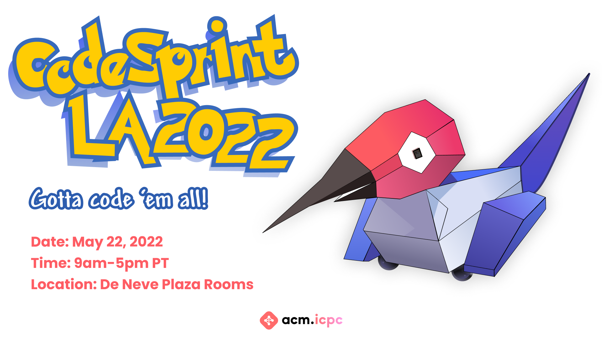

# CodeSprint LA 2022 Beginner's Guide

## Important Links
- [CodeSprint Website](http://codesprintla.com/)
- [CodeSprint Schedule](https://codesprintla.uclaacm.com/schedule)
- [Beginner Workshop Slides](https://docs.google.com/presentation/d/1sqr4ArqdiafP9VzzsnKsHFT8KpxuFZuzap58wuiRZak/edit?usp=sharing)
- [Kattis Tutorial](https://open.kattis.com/help)

## Table of Contents
- [What is competitive programming?](#what-is-a-competitive-programming-contest)
- [Error Messages](#error-messages)
- [Common Mistakes to Avoid](#common-mistakes-to-avoid)
- [C++ Help](#c++)
- [Python Help](#python)
- [Java Help](#java)
- [I want to do more competitive programming!](#next-steps-i-liked-competitive-programming-and-i-want-to-do-it-more)

## What is a competitive programming contest?
> Competitive programming is solving well-defined problems by writing
> computer programs under specified limits

Scoring is based on:
- How many problems you correctly solve
- Tie breakers come down to a time penalty

### Tie Breaker Time Penalty
If multiple people solve the same number of problems, time penalties act as the tie breaker. 
- The time penalty is the sum of the time it took you from the start of the contest to solve each problem. 
- If you have a wrong submission, 20 minutes are added to your time if you eventually solved the problem correctly

An example of tie breaker time penalty:

In this example Person B wins the tie breaker, because both Person A and Person B have solved 3 problems, but Person A has a larger time penalty than Person B.

Time penalty calculations:
- Person A: 84 + 20 (WA 1) + 116 + 20 (WA 3) + 118 = 358
- Person B: 46 + 110 + 20 (WA 4) + 106 + 20 (WA 5) + 20 (WA 5) = 322

## What are problems like?
- Most are math-y and it's more about solving an algorithmic puzzle than hacking up a solution like a hackathon
- Many problems have pesky edge cases that your program must handle
- Competitive programming contest problems are meant to be harder than your usual Leetcode problem because the goal is to have the participants differentiated based on the number of problems they can solve

## What language should I use?
We think C++ is the best choice for competitive programming:
- C++ is a very efficient (fast!) language
- Standard libraries make using data structures and algorithms easier

Generally, there are some competitive programming contest problems that cannot be solved using Python. Since problems need to be solved within a time limit, it's important for the programs to be fast. In our beginner-friendly competition, however, many of the problems can be solved in Python, so if you are more comfortable programming in Python - go for it!

## How do I know what's wrong with my solution?
### Error Messages
After you submit your solution, you will get feedback concerning whether or not you got it right, and if you didn't get it right, it will let you know generally why it failed.
| Acronym  | Message  | What does it mean? |
|---|---|---|
| AC  | Correct Answer  | Congratulations! Your submitted solution is correct!  |
| WA | Wrong Answer  | Your submitted solution doesn't pass one of our test cases, and is therefore wrong  | 
| TLE | Time Limit Exceeded  | Your submitted solution was too slow |
| CE |  Compiler Error | Your submitted solution failed to compile  |  
| RTE |  Run Time Error | Your submitted solution had an error while running  |   
| OLE |  Output Limit Exceeded | Your submitted solution had too much output  |  
| MLE | Memory Limit Exceeded | Your submitted solution used too much memory  | 

## Common Mistakes to Avoid
- Every solution should be a complete program that reads from stdin and writes to stdout. Just mere functions are not accepted
- When asked to output two space separated integers, make sure you put the space between the two integers
- When asked to output two lines, with two space separated integers per line, make sure you print out the separated integers on separate lines

# General Programming Help
## C++
Don't have a compiler/editor readily available to you?  
We recommend using [repl.it for C++](https://repl.it/languages/cpp).

Kattis also provides helpful explanations in their tutorials:  
https://open.kattis.com/help/cpp

### Example Input/Output: 1D Array
Let's say you have a problem that wants you to take an array of integers as input, and return a single integer. The first line contains the length of the array, and the elements of the array are space-separated integers on the second line.

In competitive programming contests you are allowed to use standard template libraries, and we ***highly recommend*** you use them to make your life much easier.
~~~C++
#include <iostream>
#include <vector>

using namespace std;

int main(){
    // cin the first number, representing the number of elements in the array
    int num_elements;
    cin >> num_elements;

    // cin num_elements numbers representing the elements of the array
    vector<int> elements;
    for (int i = 0; i < num_elements; i++){
        int current_element;
        cin >> current_element;
        elements.push_back(current_element);
    }

    // this is where your implementation to find the answer would go
    int ret = 0;

    // output your answer
    cout << ret << endl;
}
~~~

### Example Input/Output: 2D Array
Let's say you have a problem that wants you to take a 2D array of integers as input, and return a single integer. This sort of input may also come up as a grid of characters, but the input is handled in a similar fashion. The first line contains space-separated integers for the number of rows and columns in the grid. Each subsequent line represents a row in the grid, with space-separated integers for each column.

In competitive programming contests you are allowed to use standard template libraries, and we ***highly recommend*** you use them to make your life much easier.
~~~C++
#include <iostream>
#include <vector>

using namespace std;

int main(){
    // cin the first two numbers, representing the number of rows and columns in the grid
    int num_rows, num_cols;
    cin >> num_rows >> num_cols;

    // cin num_elements numbers representing the elements of the grid
    vector<vector<int>> grid;
    for (int i = 0; i < num_rows; i++){
        vector<int> row;
        for (int j = 0; j < num_cols; j++){
            int current_element;
            cin >> current_element;
            row.push_back(current_element);
        }
        grid.push_back(row);
    }

    // this is where your implementation to find the answer would go
    int ret = 0;

    // output your answer
    cout << ret << endl;
}
~~~

## Python
Don't have a compiler/editor readily available to you?  
We recommend using [repl.it for Python](https://repl.it/languages/python3).

Kattis also provides helpful explanations in their tutorials:  
https://open.kattis.com/help/python2  
https://open.kattis.com/help/python3

If you're still struggling, here is a helpful guide for python input:  https://www.geeksforgeeks.org/python-input-methods-competitive-programming/

### Example Input/Output: 1D Array
Let's say you have a problem that wants you to take an array of integers as input, and return a single integer. The first line contains the length of the array, and the elements of the array are space-separated integers on the second line.

~~~Python
# input the number of elements in the array from the first line
num_elements = int(raw_input())

# generate the array using the second line of input
elements = [int(x) for x in raw_input().split()]

# this where you would implement your solution
ret = 0
print(ret)

~~~

### Example Input/Output: 2D Array
Let's say you have a problem that wants you to take a 2D array of integers as input, and return a single integer. This sort of input may also come up as a grid of characters, but the input is handled in a similar fashion. The first line contains space-separated integers for the number of rows and columns in the grid. Each subsequent line represents a row in the grid, with space-separated integers for each column.

~~~Python
# input the number of elements in the array from the first line
first_line = raw_input()
num_rows = int(first_line.split()[0])
num_cols = int(first_line.split()[1])

# generate the 2D array using each subsequent line of input
grid = []
for i in range(0,num_rows):
    row = [int(x) for x in raw_input().split()]
    grid.append(row)

# this where you would implement your solution
ret = 0
print(ret)

~~~

## Java
Don't have a compiler/editor readily available to you?  
We recommend using [repl.it for Java](https://repl.it/languages/java10).

Kattis also provides helpful explanations in their tutorials:  
https://open.kattis.com/help/java

# Next Steps: I liked competitive programming and I want to do it more!
If you're eager to improve and keep doing competitive programming contests, we highly encourage you to do so!

Geeks for Geeks has a guide for the best things to study to succeed at these types of contests:  
https://www.geeksforgeeks.org/how-to-prepare-for-acm-icpc/

A fun way to compete on a regular basis is through an online platform called [CodeForces](http://codeforces.com). Once you make an account, Codeforces allows you to participate in weekly coding competitions they host. Their competitions range from Division 1 to Division 4, with Division 1 problems being the hardest, and Division 4 on the easier side. Codeforces is fun because with every contest you complete, you can see your rating level go up! Learn more at http://codeforces.com!
